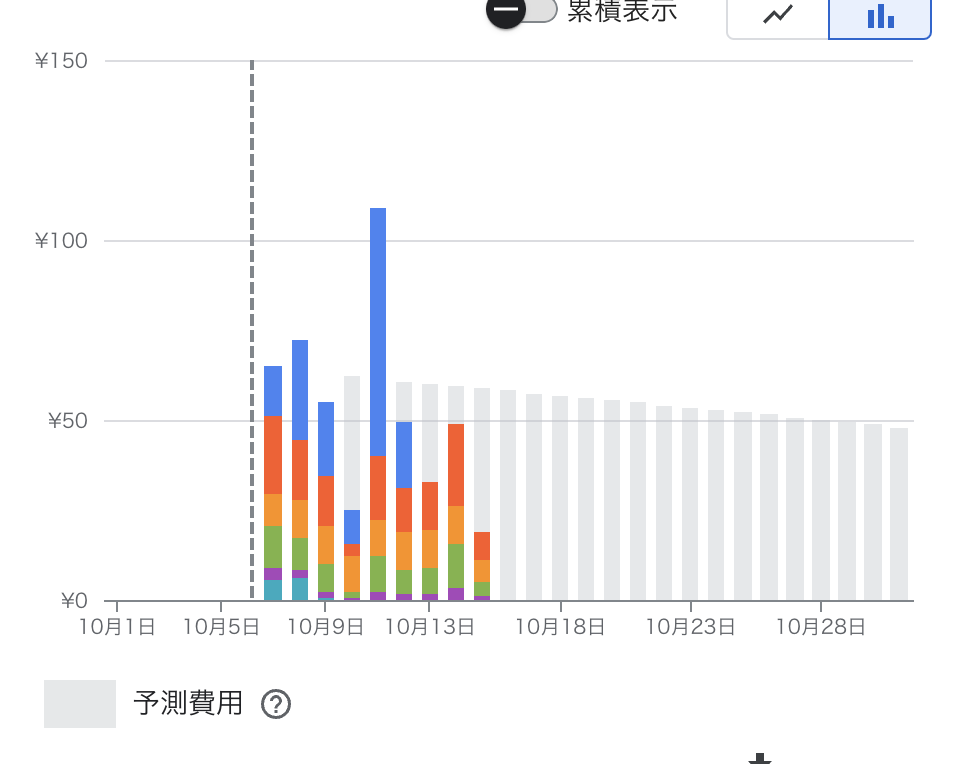

# Google CloudでMinecraftのサーバーを立てる

## 内容
MinecraftのサーバーをGoogle Cloudで立てたときのメモを順序立てて残します。  
話が脇道にそれることもあるかもしれないです。  

## 経緯
Overwatch2(5vs5のチーム制対戦FPSゲーム)を遊んでいると、敵がとんでもなく強くて全く勝てない日というものがあります。  
そんなときは避難先のゲームが欲しいものです。  
避難先、つまりMinecraftを**マルチで**いつでも遊べる環境を作ろうと思い立ちました。  
マイクラのプレイヤーは自分と友人数人を想定。  

## 注意, 免責事項
クラウドサービスを使って発生したいかなる請求にも責任を負えません。  
このページではMinecraft(マイクラ)は統合版ではなくJava版のことを指すこととします。  

## ツール選定
マイクラサーバーと言っても実現方法はいくつかあります。

1. 誰かのローカルPCでマイクラを動かして、他の参加者はオンライン接続するようにする。
2. ラズパイにマイクラサーバーをインストールして、自宅サーバーとして稼働させる。
3. レンタルVPSでマイクラサーバーを稼働する。
4. クラウドサービスでサーバーを必要なときだけ動かし、マイクラサーバーを稼働させる。

1は24/365で他の参加者に対応するのが難しいですし、PCトラブルが起こればサーバーを停止する必要も出てきます。  
そもそも自分のPCが24時間つけっぱなしというのが何となく気になります。  

2はランニングコストが低いのが魅力的ですが、  
導入コストが高いことやサーバーの性能をあとから変えることが難しいことが難点です。  
また物理端末を管理するのが自分なので、トラブル時にメンテナンスする必要もあります。  
これは1の良くない部分を解消しきれていないとも言えます。  

3はシンプルにランニングコストが高いです。  
[参考](https://vps.xserver.ne.jp/?gad_source=1&gclid=CjwKCAjwpbi4BhByEiwAMC8JnQox6tegjCfO_z-oG9kGAlb5MvdBfpaCoEh18Q16WPECrJZUYa1RaRoC-t8QAvD_BwE)  
マイクラを24時間30日遊ぶわけではないし、マイクラに飽きたらサーバーの契約を解除しないといけないという手間が発生します。  

4はVPSと似ているが必要なときだけサーバーを稼働することができます。  
クラウドサービスは基本的に従量課金なので、細かく設定すれば低コストでサーバー運用可能なはず。  
個人的にクラウドサービスを使ってみたいという思いもあるので今回はこの方法を選択。  

## とりあえずVPSを立ててみる
Google CloudのVPSサービスはCompute Engineとしてよく知られています。  
Google Cloud consoleから適当にポチポチして、インスタンスを作成して、適当に起動したり、インスタンスを停止したりしてみましょう。  
具体的な作成方法や起動方法はネットの各種情報源に譲ります。[参考](https://note.com/oyasai123/n/n4f29898fd6ea)  
インスタンスの起動に慣れたら、gcloudコマンドを使ってシェルから起動する方法も試してみましょう。  
[参考](https://yyuuiikk.org/entry/744)  
[参考](https://cloud.google.com/sdk/docs/initializing?hl=ja)  

## 料金
[参考](https://zenn.dev/cloud_ace/articles/minecraft-performance-2024)  
Compute Engineを使う上で気にしないといけない金銭コストを自分が知ってる範囲で書きます。  

### インスタンス代
インスタンスは作成や削除に料金がかからず稼働時間のみで課金されます。  
また、重要なこととして、コスト削減のためにインスタンスは**SpotVM**(旧プリエンプティブルVM)を選択します。  
これはGoogleが管理している計算資源の余剰分を、たまにGoogleの都合で停止するという条件のもとで格安で使わせてもらえるサービスです。  
> Spot VM では、標準 VM のオンデマンド価格と比べて、大半のマシンタイプと GPU で 60～91% の割引という大幅な低価格を実現できます。  
> (中略) ただし、他のタスクでリソースが必要になった場合などに、Compute Engine によって任意のタイミングで Spot VM がプリエンプトされる可能性があります。  

[料金](https://cloud.google.com/spot-vms/pricing?hl=ja)  
[マシンタイプ](https://cloud.google.com/compute/docs/machine-resource?hl=ja)  

例として、c3の東京リージョン(asia-northeast1)での料金は2024年10月現在vCPU価格が$0.0040365/hour, メモリ価格が$0.000615/(hour*GB)となっています。  
c3-standard-4はvCPUx4+Memory16GBなので$0.004546 * 4 + $0.000615 * 16 = $0.028024 = 4.18円/hourとなります。  
注意として、大阪リージョン(asia-northeast2)だと割引率の関係で東京リージョンの2倍以上の料金となります(2024年10月現在)。  

### ディスク代
インスタンスにマウントするブートディスクを作成する必要があります。  
ディスクの種類や容量に応じて課金されます。  
[料金](https://cloud.google.com/compute/disks-image-pricing?hl=ja)  

### 通信料
デフォルトがプレミアムとなっていますが、スタンダードにすると月あたり200GBまで無料になります。  
[料金](https://cloud.google.com/network-tiers/pricing?hl=ja)  

### IP代
IPアドレスを固定すると月1500円くらいするようです。  
VPSを高いと言っている手前これを許容することはできないです。  
[料金](https://cloud.google.com/vpc/network-pricing?hl=ja#all-networking-pricing)  

マイクラでマルチプレイするにはIPアドレスが必須なので、これは切実な問題です。  
これに関しては、インスタンス起動時に自動シェルスクリプトから、DiscordのwebhookにIPアドレスを送信するという方法で対応しました。  

### 料金画像

## インスタンス起動方法
webhookからCloud Run Functionsのサービスを実行し、実装したpythonプログラムからインスタンスを起動します。  
URLをポチるだけで起動できるので、少人数でマイクラを遊ぶという条件では十分。  
[参考](https://www.softbank.jp/biz/blog/cloud-technology/articles/202303/cloudfunction-auto-start-stop/)

## 使った言語・知識
shell, webhook  
java, python  
GCP: compute engine, cloud run (functions)  

